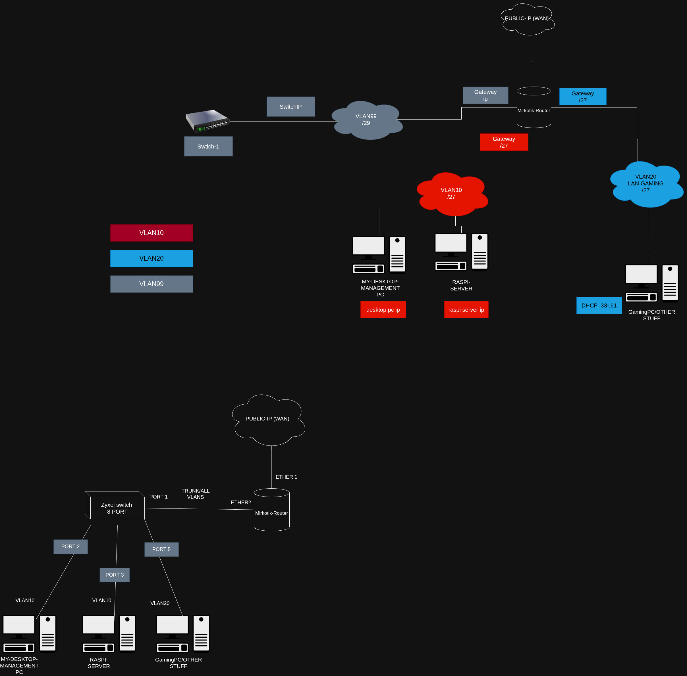

# Home Network Documentation  
  
## 1. Summary  
I built a segmented home network with multiple VLANs so that I can use them for different purposes such as Hack The Box labs, LAN gaming and to manage my network devices. The network is built around a MikroTik router, Zyxel switch, while the ISP provided router is used only for the "link" between the internet connection and the internal network.

## 2. Goals  
- To learn more about networking, routers and switches
- To learn more about IP-addresses and VLANs
- To make a real lab environment at home
  
## 3. Network Overview  
The network currently uses three VLANs, each with their own purpose:
	- Name: VLAN 10: Management and trusted internal devices
	- Name: VLAN 20: LAN gaming, guest devices and HTB-Labs
	- Name: VLAN 99: Switch management

VLAN 10 and VLAN 20 uses a /27 subnet mask while VLAN 99 uses a /29 subnet mask. These subnet sizes were chosen to allow future expansion without requiring a redesign of the network.

### Network Topology

## 4. Core Components  
  
### Router / Firewall  
- Model: MikroTik
- Role: Primary router, firewall, gateway and VPN endpoint
- Configuration notes: Handles NAT, DHCP,  VLAN routing and WireGuard VPN endpoint with remote access
### ISP Device
- Model: ISP-provided router
- Role: Acts as a "dummy switch" device between the ISP connection and the MikroTik router
- Configuration notes: Only used for the ISP connection

### Switches  
- Model: Zyxel
- Role: Managed switch used for VLAN distribution and internal network connectivity
- Configuration notes:  Carries VLAN-tagged traffic from the router and provides access ports for selected devices
- 
### Servers / Hosts  
- Device: Raspberry Pi
- Role: Web and DNS server with ad blocking
- Notes: Runs Pi-hole as the local DNS server for the network forwarding DNS requests to Cloudflare and blocks ads at the domain level, hosts my personal website
  
## 5. Network Segmentation  
### Main LAN:
- VLAN ID: 10
- Purpose: Used for servers, management and other trusted devices
- Notes: Intended for trusted devices, servers, and management-related systems
### Guest network:  
- VLAN ID: 20
- Purpose: For LAB use and guest devices

### Switch network:
- VLAN ID: 99
- Purpose: Used for switches
- Notes: Only for switches and I can add more devices later if needed
## 6. Addressing and Services  
- DHCP: Provided by the MikroTik router on selected VLANs
- DNS: Pi-hole running on Raspberry Pi, forwarding DNS requests to Cloudflare
- Gateway: MikroTik router is the default gateway for my network
- Static leases: Used for selected devices, for example servers etc.
- Important internal services:
	- Pi-hole
	- Personal website
	- WireGuard VPN
  
## 7. Security Considerations  
- Firewall rules: Inter-VLAN traffic is restricted by default. Communication between VLAN 10, VLAN 20, and VLAN 99 is only allowed when explicitly required
- Network isolation: The network is segmented into separate VLANs for management, lab / guest use, and switch management in order to reduce unnecessary access between devices
- Remote access: Remote access is handled through WireGuard VPN on the MikroTik router instead of exposing internal services directly to the internet
- Monitoring / logging:  
- Risks:
	- Misconfigured firewall or NAT rules could weaken the intended isolation between VLANs
	-  Even a minimal public-facing static website introduces some level of risk and must still be taken into account.
## 8. Current Limitations  
-  The switch only has 8 ports currently and therefore limits the capability of adding physical devices to the network with RJ-45 cables
-  No built-in WLAN capability on the MikroTik router currently

## 9. Future Improvements  
-  WLAN capable router
-  Another switch
## 10. What I Learned  
- IP-Networking
- How to configure VLANs, firewall and NAT
- How to plan network size according to the use case and future growth
- How to configure VPN and to allow selected peers to access certain services or devices only
- System administration
- Risk evaluation
- Always take backups of the router and switch configuration!
  
## 11. Portfolio Value  
This documentation demonstrates practical skills in:  
- networking
- infrastructure design
- system administration
- security-minded planning
- technical documentation
  
## 12. Summary for Employers  
This home lab project helped me build practical experience in networking, segmentation, firewall configuration, and infrastructure planning. I designed the network around separate VLANs for management, lab use, and switch management, while also implementing services such as Pi-hole and WireGuard. The project reflects both technical curiosity and a structured approach to learning, testing, and documenting real-world infrastructure.